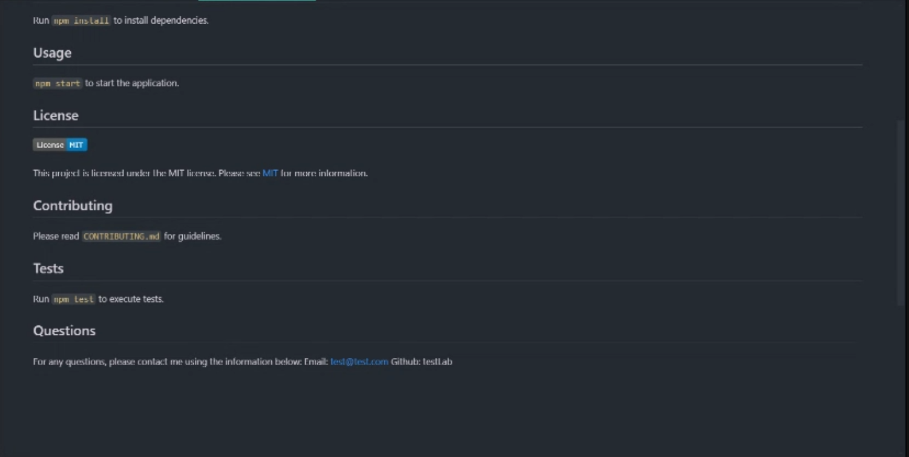

  # MVP ReadMe Generator

  ## Description
  The README Generator is a command-line application designed to simplify the process of creating high-quality README files for your projects. With this tool, developers can quickly generate a comprehensive README that includes essential sections such as project title, description, installation instructions, usage guidelines, contribution guidelines, and license information.

  ## Table of Contents
   * [Installation](#installation)
   * [Usage](#usage)
   * [License](#license)
   * [Contributing](#contributing)
   * [Tests](#tests)
   * [Questions](#questions)

   ## Installation
   To install the README Generator, clone this repo and run `npm install`.

   ## Usage
   After installation, run `node index.js` in the terminal and follow the prompts. Once the prompts are successfully filled the application will create a README.md file in your project.
   
   Click the image below or visit this [link](https://drive.google.com/file/d/1awsAuUNo3xgpzTDm8dO1kOKUkcTCXNUv/view?usp=sharing) to view example. 
  
  
   <!--  -->

   ## License
   
  

  This project is licensed under the MIT license. Please see [MIT](https://opensource.org/licenses/MIT)
  for more information.

   ## Contributing 
   Contributions are welcome! Please feel free to submit a pull request or open an issue for any suggestions or improvements.

   ## Tests
   There are no tests at this time.

   ## Questions
   For any questions, please contact me using the information below:
   Email: chastainjohnathan75@gmail.com
   Github: JohnathanChastain
  